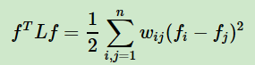

最近项目中应用到了k-means聚类算法和谱聚类算法，在此整理一下原理、使用体会和调包调参注意事项以作备忘。
#K-Means
kmaens属于原型聚类算法中的一种，这类算法整体思路是类划分可以用一组原型来刻画。关于算法步骤已经很熟悉就不赘述。

以前的学习中没有注意到的是K-Means算法的优化函数

这个函数求最小值其实是个NP难问题。因此，我们采用逐步迭代优化的方法来求解。
##k-means的适用情况
在类似于高斯分布的情况下表现比较好。不适用于非凸的情况，对异常点和噪声敏感（不适用于大小差异很大的情况）。
##聚类算法评价指标
本次使用了两个评价指标：1.sc-index（轮廓系数） 2.purity。评价指标分为内部指标和外部指标。轮廓系数就属于内部指标，用来衡量聚类的紧密程度。purity属于外部指标，需要正确标签的辅助，用来衡量分类结果的准确度。

在实际应用中， 应该同时结合两种指标来评估。当内部指标良好而外部指标差时，说明本聚类算法并不适用于当前情况。当外部指标良好而内部指标差时，说明当前可能需要调参。
###纯度（Purity）
纯度是一种外部评价指标，需要正确的标签参与计算。纯度的计算公式为：

其中N代表总数，Wk代表第k个聚类簇，C = {c1, c2, . . . , cJ}是文档集合，cJ表示第J个文档。这个方法计算简单，值在0~1之间，完全错误值为0，完全正确值为1。
###轮廓系数（Silhouette Coefficient）
轮廓系数作为一种内部聚类评价指标，综合考虑内聚度和分离度两种因素，是一种不需要正确标签参与计算的评价指标，可以用来在相同原始数据的基础上用来评价不同算法、或者算法不同运行方式对聚类结果所产生的影响。该算法的计算公式为：

其中a代表某个样本与其所在簇内其他样本的平均距离，b代表某个样本与其他簇样本的平均距离。轮廓系数的值介于 [-1,1] ，越趋近于1代表内聚度和分离度都相对较优。
#谱聚类
谱聚类中也使用到了k-means算法。所谓谱就是指方阵特征值的全体（谱半径定义为特征值最大值）

谱聚类来源于图论，他把样本点看作无向图中的点，并用某种方法（常见的有三种）为边分配权值（距离近的权值大，距离远权值小），然后进行某种切分，使得同一类内权值大，类与类之间权值小。

思路有了之后考虑如何逐步实现。首先讨论如何构建相似矩阵（关联矩阵）
##相似矩阵的构建
邻接矩阵是学习图的表示时涉及到的概念，本算法原理中提到的是相似矩阵，我认为是一个东西。我们拿到的数据集进行聚类之前是每行代表一条数据，只有点没有边。因此需要某种规则确定带有权值的边，满足距离近权值高，距离远权值低的要求。目前主流的有三种方式：
###ϵ-邻近法
用欧氏距离来衡量点与点之间的距离。本方法简单来说就是设置一个阈值，大于这个阈值的将权值设为0，小于这个权值将权值设为ϵ
###k-近邻法
两点互为k近邻则边权值为
，否则为0.
###全连接法
这种方法为每条边都赋予大于0的权重。本方法可以选择不同的核函数，常用的有ploy、rbf等核函数。用这种方法来建立相似矩阵是最普遍的。wij=wji= 
##切图方式之RatioCut切图
有了我们的相似矩阵W和度矩阵D，我们可以开始考虑切分了，目的是同一类中的点之间权值之和高，与此同时，不同类之间点权值之和低。用数学表示可以写成其中Ai上面一横表示Ai的补。但很显然，这样定义切图最小化时会有个问题，可能会出现这样的情况：

很可能某个集合点的个数会特别少。为了解决这个问题，自然而然想到，在满足cut的前提下尽量使每个集合点的个数要多。**有了这个想法以后，想办法体现在公式上。注意这一点的提现，是把集合中点的个数放在原公式中的分母上，这样变成了一个考虑集合点个数的最小化的问题**

那么接下来要做的事情就是求解本公式的最小值时Ai的划分。看似现在陷入了僵局，其实需要引入两个东西才能求解到。
###拉普拉斯矩阵
拉普拉斯矩阵的定义为：L=D-W。引入拉普拉斯矩阵的目的是为了运用他的一条性质：对于任意的向量f,我们有
###指示向量hj
hj为指示向量
这里应用了上文提到的拉普拉斯的矩阵的性质，巧妙得把RatioCut问题表示了出来，让切割问题和拉普拉斯矩阵产生了关系，也就是和相似矩阵产生了关系。
这样一来，RatioCut可以表示为

其中tr()表示矩阵的迹。现在的任务是最小化tr(HTLH)，其中HTH=1。我们的目标是找到最小特征值，这是个NP难问题，可以参考PCA的思路，采用维度规约的方式近似解决。转而寻找k个最小的特征值，从而将维度从n降到了k。之后，将对应的k个最小的特征向量进行标准化。之后就是个nxk的矩阵，然后用传统的聚类算法（常用k-means）来对每一行进行一次聚类。
