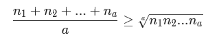
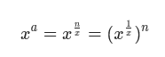
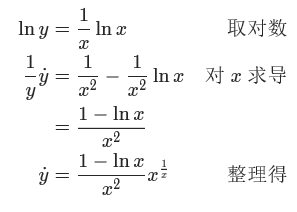

#剪绳子
给你一根长度为 n 的绳子，请把绳子剪成整数长度的 m 段（m、n都是整数，n>1并且m>1），每段绳子的长度记为 k[0],k[1]...k[m-1] 。请问 k[0]*k[1]*...*k[m-1] 可能的最大乘积是多少？例如，当绳子的长度是8时，我们把它剪成长度分别为2、3、3的三段，此时得到的最大乘积是18。

来源：力扣（LeetCode）
链接：https://leetcode-cn.com/problems/jian-sheng-zi-lcof
著作权归领扣网络所有。商业转载请联系官方授权，非商业转载请注明出处。

#思路与不足
       
     public int cuttingRope(int n) {
            int ans=0;
            int i=2;
            if(n==2)
                return 1;
            else
            {
                while ((n/i)>=1)
                {
                    int t=n/i;
                    int tm=n;
                    int tmp=1;
                    while (tm>0)
                    {
                        if(tm/t>=2)
                        {tmp=tmp*t; tm-=t;}
                        else
                        {tmp=tmp*tm; tm=0;}
                    }
                    if(tmp>ans)
                        ans=tmp;
                    i++;
                }
                return ans;
            }
    }
我的思路：意识到把绳子均分会得到好的结果，但不知道均分几段会有最优解，之后盲目写代码均分求解。通过率只有70%

参考了题解后意识到，进行这种含有数学思路题目的求解时，不单单要有想法，要有清楚的数学推理来支撑想法才能得到正确结果。

在进行数学推理前，首先你缺少的是对数学问题进行建模的想法。对于此问题，首先提取题目限制条件为
 
    设剪绳子为a段
    n=n1+n2+...+na
    所求目标为
    max(n1*n2*...na)
问题转化为求解max(n1*n2*...na)，和固定的情况下求乘积的极值联想到不等式。

   

当n1=n2=...na时取最大值。证明了均分取值最大。那么均分成几份取值最大呢？

所求为

对y求导，两边取对数，然后求驻点令y点=0得：

​

x0=e≈2.7

然后应该尝试推论：尽可能将绳子以长度等分为多段时，乘积最大

正是这条的缺失导致程序没有运行正确。在与3求余后剩2时，不应该分成1+1，而应该直接保留。

